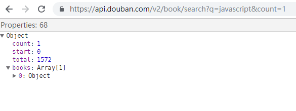
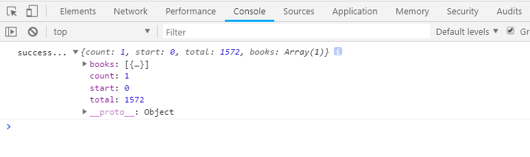
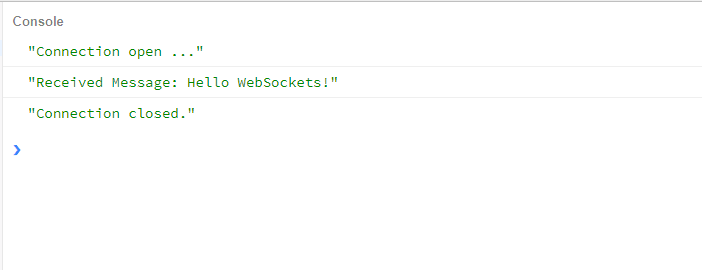

### 同源策略以及跨域

### 一、同源策略

同源策略(Same-Origin Policy)。所谓的 同源 是`域名、协议、端口号`相同。不同的客户端脚本（javascript，ActionScript）在没有授权的情况下，不能读取对方资源。简单来说，浏览器允许包含在页面 A 的脚本访问第二个页面 B 的数据资源，这一切是建立在 A 和 B 页面是同源的基础上。

### 二、跨域与跨域请求

跨域 简单的来说，指的是两个资源非同源。出于安全方面的考虑，页面中的 JavaScript 在请求非同源的资源时就会出 跨域问题 ——即跨域请求，这时，由于同源策略，我们的请求会被浏览器禁止。也就出现了 我们常说的 跨域 问题。

下面，我们看一下，具体哪些情况会出现跨域问题(具体策略限制)：


### 三、跨域解决方案

#### 1. JSONP 跨域

为了便于客户端使用数据，逐渐形成了一种非正式传输协议。人们把它称作 JSONP。该协议的一个要点就是允许用户传递一个 callback 参数给服务端，然后服务端返回数据时会将这个 callback 参数作为函数名来包裹住 JSON 数据，这样客户端就可以随意定制自己的函数来自动处理返回数据了。

JSONP 实现原理:

-   js 请求资源会被限制，但是在页面中，`script`标签是没有限制的，`img，iframe`标签也是一样的；
-   通过 sctipt 标签的 src 属性，请求服务器，并且通过参数（如：`?callback=func`,func 为本地的一个方法）,告诉服务器返回指定格式的 js 脚本，并将数据封装在此脚本中；
-   服务器在配合客户端返回一段脚本(如：`{count: 1, start: 0, total: 1572}`),其实返回的就是客户端一个本地的可执行方法，并且将要返回的数据封装在了参数里;
-   请求到资源后，本地就会执行此方法，通过对参数的处理，也就获取到了我们所要的数据。

假如我们想要请求豆瓣 API 的接口去获取数据`https://api.douban.com/v2/book/search?q=javascript&count=1`，直接在浏览器里输入地址请求可以返回数据，是没有问题的。如图：


但是如果我们执行下下面一段代码的时候可能会出现跨域问题而报错。

```js
<!DOCTYPE html>
<html lang="en">
<head>
    <meta charset="UTF-8">
    <title>JSONP跨域</title>
</head>
<body>
    <div>
        <button id="btn">点击</button>
    </div>
    <script>
        window.onload = function(){
        	let btn = document.getElementById('btn');
        	btn.onclick = function () {
		        let xhr = new XMLHttpRequest();
		        //豆瓣图书API地址
		        let url = 'https://api.douban.com/v2/book/search?q=javascript&count=1'
		        xhr.open('get',url);
		        xhr.send();
		        if(xhr.readystateonchange == 4 && xhr.status == 200) {
			        console.log('success',xhr.response);
		        }else{
		        	console.log('err',xhr);
                }
            }
        }
    </script>
</body>
</html>
```

浏览器截图为：


当出现上述情况时，客户端请求页面和服务端不属于同源，已经出现了跨域，这时我们可以使用 JSONP 来解决上述问题。

JSONP 跨域客户端的具体实现：

```js
<!DOCTYPE html>
<html lang="en">
<head>
    <meta charset="UTF-8">
    <title>JSONP跨域</title>
</head>
<body>
    <div>
        <button id="btn">点击</button>
    </div>
    <script>
        //回调函数
        function handleResponse(response) {
	        	console.log('success...',response);
        }
        window.onload = function (){
        	let btn = document.getElementById('btn');
        	btn.onclick = function() {
        		//创建一个script标签
                let script = document.createElement('script');
                //设置srript的src
                script.src = "https://api.douban.com/v2/book/search?q=javascript&count=1&callback=handleResponse";
                //插入到文档中
                document.body.insertBefore(script,document.body.firstChild)
            }
        }
    </script>

</body>
</html>
```

浏览器截图为：


#### 2. postMessage 跨域

    window.postMessage() 方法可以安全地实现跨源通信。通常，对于两个不同页面的脚本，只有当执行它们的页面位于具有相同的协议（通常为https），端口号（443为https的默认值），以及主机  (两个页面的模数 Document.domain设置为相同的值) 时，这两个脚本才能相互通信。window.postMessage() 方法提供了一种受控机制来规避此限制，只要正确的使用，这种方法就很安全。

    window.postMessage() 方法被调用时，会在所有页面脚本执行完毕之后（e.g., 在该方法之后设置的事件、之前设置的timeout 事件,etc.）向目标窗口派发一个  MessageEvent 消息。 该MessageEvent消息有四个属性需要注意： message 属性表示该message 的类型； data 属性为 window.postMessage 的第一个参数；origin 属性表示调用window.postMessage() 方法时调用页面的当前状态； source 属性记录调用 window.postMessage() 方法的窗口信息。

语法：

```js
otherWindow.postMessage(message, targetOrigin, [transfer]);
```

参数：

-   otherWindow ： 其他窗口的一个引用，比如在 A 页面中使用的 window；
-   message ： 将要发送到其他 window 的数据；
-   targetOrigin ：通过窗口的 origin 属性来指定哪些窗口能接收到消息事件，其值可以是字符串"\*"（表示无限制）或者一个 URI；
-   transfer(可选) ： 是一串和 message 同时传递的 Transferable 对象. 这些对象的所有权将被转移给消息的接收方，而发送一方将不再保有所有权。

示例代码如下：

```js
// postMessage
// 窗口A(http:A.com)向跨域的窗口B(http:B.com)发送信息
window.postMessage("data", "http://B.com");
// 在窗口B中监听
window.addEventListener(
    "message",
    function(event) {
        console.log(event.origin);
        console.log(event.source);
        console.log(event.data);
    },
    false
);
```

#### 3. WebSocket

WebSocket 协议在 2008 年诞生，2011 年成为国际标准。所有浏览器都已经支持了。

它的最大特点就是，服务器可以主动向客户端推送信息，客户端也可以主动向服务器发送信息，是真正的双向平等对话，属于服务器推送技术的一种。

特点：

-   没有同源限制，客户端可以与任意服务器通信。
-   协议标识符是 ws（如果加密，则为 wss），服务器网址就是 URL。

```js
var ws = new WebSocket("wss://echo.websocket.org");

ws.onopen = function(evt) {
    console.log("Connection open ...");
    ws.send("Hello WebSockets!");
};

ws.onmessage = function(evt) {
    console.log("Received Message: " + evt.data);
    ws.close();
};

ws.onclose = function(evt) {
    console.log("Connection closed.");
};
```

浏览器截图如下：


详情参考阮一峰老师的[WebSocket 教程](http://www.ruanyifeng.com/blog/2017/05/websocket.html)

#### 4. CORS

CORS 需要浏览器和服务器的同时支持。目前所有的浏览器都支持，IE 浏览器不能低于 IE10。

整个 CORS 通信的过程都是浏览器自动完成的，不需要用户参与。对于开发者来说，CORS 通信与同源的 AJAX 通信没有差别，代码完全一样，浏览器一旦发现 AJAX 请求，就会添加一些附加头信息，有时还会多出一次附加请求，但是用户不会有感觉。因此实现 CORS 通信的关键是服务器。只要服务器实现了 CORS 接口，就可以实现跨源通信了。

详情参考阮一峰老师的[跨域资源共享 CORS 详解](http://www.ruanyifeng.com/blog/2016/04/cors.html)
