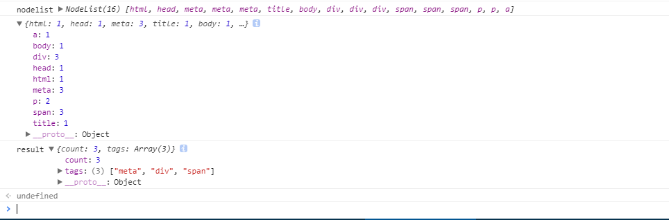

### JavaScript 面试题总结(二)

#### 一、题目一：

#### 描述：

    1. 获取某个页面所使用的所有标签
    2. 并且统计出现次数最多的标签

1. 第一步先获取所有的标签，并将类数组对象转化为数组，统计每一种标签出现的次数

```js
/**
 * 获取所有的标签节点，并且对每一种标签进行统计个数，返回一个对象
 */
function getAllTags() {
    let nodeList = document.querySelectorAll("*");

    obj = Array.from(nodeList).reduce((pre, next) => {
        pre[next.localName] = pre[next.localName] ? ++pre[next.localName] : 1;
        return pre;
    }, {});
    return obj;
}
```

#### 注意：

    1. document.querySelectorAll("*")可以获取所有的节点对象，这里的返回结果为类数组对象;
    2. Array.from()可以把一个类数组对象转化为一个数组；
    3. pre[next.localName] = pre[next.localName] ? ++pre，这里要注意的是，返回的类数组对象的每一项也都是一个对象，相同的节点有不同的类名也会归为一个不同项，我们可以通过判断localName来判断是否是相同的标签。

如图：


2. 统计出现次数最多的标签

```js
function getMaxCount(obj) {
    let result = {
        count: 0,
        tag: ""
    };

    Object.keys(obj).forEach(item => {
        if (result.count < obj[item]) {
            result.count = obj[item];
            result.tag = item;
        }
    });

    return result;
}
```

```js
function getResult() {
    let obj = getAllTags();

    let result = getMaxCount(obj);
    return result;
}
```

上面的代码虽然解决此题，但是还有一个问题，如果有两个或者多个标签出现的次数相同并且次数最多，上面的代码并不能获取正确的结果，我们仍然需要进行改进,我们可以把 getMaxCount 方法进行改造。

我们可以在原有基础上，把 result 对象 tag 改变为 tag 数组，用来存放所有的标签，用 tempTags 来临时存放出现次数相同的标签。如果`result.count < obj[item]`,需要注意的是，要把 tempTags 临时数组清空，因为此时已经有出现次数更多的标签出现。

```js
/**
 *
 * @param {object} obj 要传入的类数组对象
 * 返回一个对象
 */
function getMaxCount(obj) {
    // 临时存储个数相同的标签
    tempTags = [];

    /**
     * count : 标签个数
     * tags : 出现次数相同的标签
     */
    let result = {
        count: 0,
        tags: []
    };

    Object.keys(obj).forEach(item => {
        if (result.count < obj[item]) {
            result.count = obj[item];
            result.tags[0] = item;
            // 如果有出现次数更多的标签，把临时数组置为空
            tempTags = [];
        } else if (result.count === obj[item]) {
            tempTags.push(item);
        }
    });

    if (tempTags.length > 0) {
        tempTags.forEach(item => {
            result.tags.push(item);
        });
    }

    return result;
}
```

如图：



#### 二、题目二：

#### 描述：

有 A、B、C 三个请求，C 依赖于 A 和 B 连个请求，如何实现？

```js
let getA = new Promise((resolve, reject) => {
    setTimeout(() => {
        resolve(2);
    }, 3000);
});

let getB = new Promise((reolve, reject) => {
    setTimeout(() => {
        reolve(3);
    }, 1000);
});

function getC(a, b) {
    return a + b;
}

Promise.all([getA, getB])
    .then(data => {
        console.log(data);
        return getC(data[0], data[1]);
    })
    .then(res => {
        console.log("res", res); // 5
    });
```

这里可以使用 promise.all()来并行实现，用来提高效率。当然也可以使用 async 来实现，不过 async 是同步来执行的，可能会有一定的效率问题。

#### 本题参考资料：

[1. es6 中的 promise.all 使用问题](https://segmentfault.com/q/1010000008174264)

[2. ES6 Promise 并行执行和顺序执行](https://www.jianshu.com/p/dbda3053da20)

[3. 阮一峰 es6 中 promise.all 的使用](http://es6.ruanyifeng.com/#docs/promise#Promise-all)

#### 三、写出下列输出

```js
var a = {
    value: 1,
    func1: function() {
        console.log(this.value);
    },
    func: () => {
        console.log(this.value);
    }
};

a.func1(); // 1
a.func(); // undefined
```

这里主要考察了 es6 中的箭头函数。在 a 对象中，func1 是一个普通函数，func 是一个箭头函数，由于箭头函数使得 this 由动态变成静态，当我们调用 a.func1()的时候 this 指向的为 a,输出为 1；在调用 a.func()的时候，由于 func()是一个箭头函数，使得 this 指向了全局对象 window，window 中没有 value 值，所以输出结果为 undefined。

如果我们在全局对象中添加一个变量 var value = 3，则输出结果就为 3。代码如下：

```js
var a = {
    value: 1,
    func1: function() {
        console.log(this.value);
    },
    func: () => {
        console.log(this.value);
    }
};
var value = 3;

a.func1(); // 1
a.func(); // 3
```
