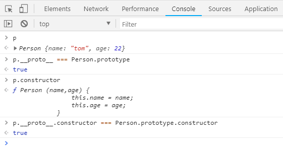
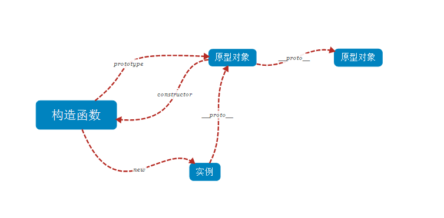

### js 对象和原型链

#### 一、创建对象的几种方式

1. 对象直接量：

```js
var o1 = { name: "tom" };
var o2 = new Object({ name: "jack" });
```

2. 构造函数：

```js
function Person(name, age) {
    this.name = name;
    this.age = age;
}
var p = new Person("rose", 28);
```

3. Object.create()方式：

```js
var p = { name: "john" };
var p1 = Object.create(p);
```

#### 二、new 做了哪些事?

    1. 新建一个对象；
    2. 修改新建对象的原型对象为构造函数的原型对象；
    3. 修改this的指向；
    4. 返回新建对象。

```js
/*
 * 1. 新建一个对象
 * 2. 修改新建对象的prototype指向构造函数的prototype
 * 3. 修改this的指向
 * 4. 返回新建对象（如果构造函数没有返回值）
 */
function new2(callback) {
    // 1.新建一个对象
    // 2. 修改新建对象的prototype指向构造函数的prototype
    let obj = Object.create(callback.prototype);
    /*
        *   或者
            var obj={};
            obj.__proto__= callback.prototype;
        */

    // 修改this的指向为新建对象obj
    let result = callback.call(obj);

    // 返回新建对象
    if (typeof result === "object") {
        // 如果构造函数有返回值，并且是对象，则返回这个对象
        return result;
    } else {
        // 否则返回新建的对象
        return obj;
    }
}

function P() {
    this.name = "name";
}

var p1 = new2(P);
```

注意：call、apply、bind 的简单区别：

    1. call、apply都是立即执行函数，bind是返回一个新的函数，他们三个的作用都是为了改变this的指向,第一个参数都是this要指向的对象；
    2. call和bind的第一个参数可以跟很多个参数，而apply的第二个参数是一个数组。

#### 三、构造函数、原型、实例之间的关系：

    每个构造函数都有一个原型对象，原型对象都有一个指向构造函数的指针，而实例都包含一个指向原型对象的内部指针。------《JavaScript高级程序设计》

```js
function Person(name, age) {
    this.name = name;
    this.age = age;
}
var p = new Person("tom", 22);
console.log(p);
console.log(p.__proto__ === Person.prototype);
console.log(p.constructor);
console.log(p.__proto__.constructor === Person.prototype.constructor);
```

他们之间的关系如下图：



#### 四、对象的继承：

1. 对象的继承一：借助构造函数实现继承

```js
function Parent_1(name, age) {
    this.name = name;
    this.age = age;
}

Parent_1.prototype.say = function() {
    console.log("parent say hello");
};

function Child_1(naem, age, gender) {
    // 借助构造函数实现继承的关键代码
    // 通过在子类里调用父类构造函数，并且改变this的指向实现继承
    Parent_1.call(this, name, age);

    this.gender = gender;
}

var c1 = new Child_1("jack", 20, "男");
c1.say(); // Uncaught TypeError: c1.say is not a function
```

借助构造函数实现继承的关键代码的就是`Parent_1.call(this,name,age)`,通过在子类构造函数中调用父类的构造函数并且修改 this 的执行来实现继承。

    缺点：可以实现继承，但是只能继承父类构造函数的属性和方法，不能继承父类原型链上的方法和属性.

2. 对象的继承二：原型链继承

```js
function Parent_2(name, age) {
    this.name = "parent name";
    this.age = 20;
}

Parent_2.prototype.say = function() {
    console.log("parent say hello");
};

function Child_2(gender) {
    this.gender = gender;
}

// 借助原型链继承的关键代码
// 修改子类构造函数的原型修改为父类父类的实例，这样子类实例就可以通过原型链，继承父类构造函数中的属性和方法，而且也可以继承父类构造函数原型中的属性和方法
Child_2.prototype = new Parent_2();

var c2 = new Child_2("男");

c2.say(); // parent say hello
```

```js
function Parent_2(name, age) {
    this.name = "parent name";
    this.age = 20;
    this.data = [1, 2, 3];
}

Parent_2.prototype.say = function() {
    console.log("parent say hello");
};

function Child_2(gender) {
    this.gender = gender;
}

// 修改子类构造函数的原型修改为父类构造函数的实例
Child_2.prototype = new Parent_2();

var c2 = new Child_2("男");
var c3 = new Child_2("男");

c2.say(); // parent say hello
c2.data.push(4);
console.log(c2.data); // [1, 2, 3, 4]
console.log(c3.data); // [1, 2, 3, 4]
```

原型链继承的关键代码就是`Child_2.prototype = new Parent_2()`,通过修改子类构造函数的原型链为父类实例，这样在访问子类实例的时候，子类实例会通过原型链访问到父类实例中的属性和方法，而且还会通过原型链来继承父类构造函数原型对象中的属性和方法。

    缺点：通过原型链可以解决通过构造函数实现继承中的缺点，不仅可以继承父类构造函数中的属性和方法，而且还可以继承父类原型对象中的属性和方法，但是如过父类构造函数中的属性为引用类型的时候，通过修改一个实例属性的时候，会影响到其他实例。

3. 对象的继承三：组合继承

```js
function Parent_3() {
    this.name = "parent";
    this.data = [1, 2, 3];
}

Parent_3.prototype.say = function() {
    console.log("hello word");
};

function Child_3(gender) {
    // 通过构造函数来继承父类构造函数中的属性和方法
    Parent_3.call(this);
    this.gender = "男";
}

// 通过修改子类构造函数的原型为父类构造函数实例来继承父类构造函数的属性和方法，以及继承父类构造函数原型对象上的属性和方法
Child_3.prototype = new Parent_3();

var c4 = new Child_3();
var c5 = new Child_3();

console.log(c4.constructor === Child_3); // false

c4.data.push(4);
console.log(c4.data); // [1, 2, 3, 4]
console.log(c5.data); // [1, 2, 3]
console.log(c4.say()); // hello word
console.log(c5.say()); // hello word
```

    缺点：在上面的组合继承中，在代码`Child_3.prototype = new Parent_3()`和`Child_3.prototype = new Parent_3()`中Parent_3()执行了两次，还可以对其进行优化。`console.log(c4.constructor === Child_3 )`的执行结果为`false`，说明我们修改了`Child_3.prototype`中constructor的指向，这不是我们所希望看到的。

组合继承的优化一:

```js
function Parent_3() {
    this.name = "parent";
    this.data = [1, 2, 3];
}

Parent_3.prototype.say = function() {
    console.log("hello word");
};

function Child_3(gender) {
    // 通过构造函数来继承父类构造函数中的属性和方法
    Parent_3.call(this);
    this.gender = "男";
}

// 通过修改子类构造函数的原型为父类构造函数的原型
Child_3.prototype = Parent_3.prototype;

var c4 = new Child_3();
var c5 = new Child_3();

console.log(c4.constructor === Child_3); // false

c4.data.push(4);
console.log(c4.data); // [1, 2, 3, 4]
console.log(c5.data); // [1, 2, 3]
console.log(c4.say()); // hello word
console.log(c5.say()); // hello word
```

在上面的代码中通过`Child_3.prototype = Parent_3.prototype`来解决`Parent_3`执行两次的问题。

组合继承的优化二:

```js
function Parent_3() {
    this.name = "parent";
    this.data = [1, 2, 3];
}

Parent_3.prototype.say = function() {
    console.log("hello word");
};

function Child_3(gender) {
    // 通过构造函数来继承父类构造函数中的属性和方法
    Parent_3.call(this);
    this.gender = "男";
}

// 通过修改子类构造函数的原型为父类构造函数的原型
Child_3.prototype = Parent_3.prototype;
Child_3.prototype.constructor = Child_3;

var c4 = new Child_3();
var c5 = new Child_3();

console.log(c4.constructor === Child_3); // true

c4.data.push(4);
console.log(c4.data); // [1, 2, 3, 4]
console.log(c5.data); // [1, 2, 3]
console.log(c4.say()); // hello word
console.log(c5.say()); // hello word
```

在上面代码中通过`Child_3.prototype.constructor = Child_3`来解决 Child_3.prototype`中 constructor 的指向问题。
