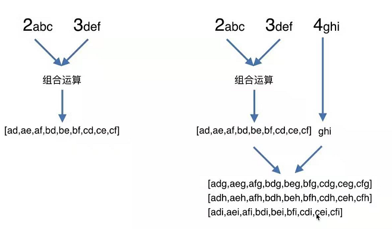

### letCode 算法题-数组

给定一个仅包含数字 2-9 的字符串，返回所有它能表示的字母组合。

给出数字到字母的映射如下（与电话按键相同）。注意 1 不对应任何字母。


示例:

输入："23"
输出：["ad", "ae", "af", "bd", "be", "bf", "cd", "ce", "cf"].

```js
var letterCombinations = function(digits) {
    // 建立电话号码映射关系
    let map = [
        "",
        "",
        "abc",
        "def",
        "ghi",
        "jkl",
        "mno",
        "pqrs",
        "tuv",
        "wxyz"
    ];
    // 把输入的数值变为数组
    let nums = digits.split("");

    let code = nums.map(item => {
        return map[item];
    });

    // 递归
    let fun = arr => {
        // 临时变量用来保存前两个组合的结果
        let result = [];

        // 最外层的循环是遍历第一个元素，里层的循环是遍历第二个元素
        for (let i = 0; i < arr[0].length; i++) {
            for (let j = 0; j < arr[1].length; j++) {
                result.push(`${arr[0][i]}${arr[1][j]}`);
            }
        }

        // 用前两个组合的结果用来替换前两个元素
        arr.splice(0, 2, result);

        if (arr.length > 1) {
            fun(arr);
        } else {
            return result;
        }
    };

    return fun(code);
};
```

提示：

此题解题思路需要考虑，如果有多于两个数字时，应该先考虑把前两个数字结合，然后再两两结合。

本题主要是用到了数组 splice()方法，以及递归调用。

如图：


