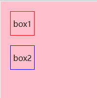
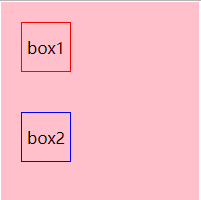
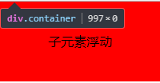
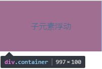

### css 盒模型

#### 一、css 盒模型分类：

css 盒模型分为 IE 盒模型和标准盒模型，以下是 IE 盒模型和标准盒模型的对比

|    分类    |               区别               | box-sizing  |
| :--------: | :------------------------------: | :---------: |
| IE 盒模型  |  content 包含 padding 和 border  | border-box  |
| 标准盒模型 | content 不包含 padding 和 border | content-box |

#### 二、js 如何获取到盒模型的宽度和高度？

以下是三种获取 dom 节点盒模型宽度和高度的方法以及他们的优缺点

|                   方式                    |                                     优点                                      |              缺点              |
| :---------------------------------------: | :---------------------------------------------------------------------------: | :----------------------------: |
|          dom.style.width/height           |                                      略                                       | 只能获取到内联样式的宽度和高度 |
|      dom.current.style.width/height       |        可以获取到当前 dom 节点的宽度和高度、无论是内联还是外部链接样式        |       只有 IE 浏览器支持       |
| window.getComputedStyle(dom).width/height | 兼容性比较好，可以获取到当前 dom 节点的宽度和高度，无论是内联还是外部链接样式 |               略               |

### 三、BFC

> BFC 定义

    BFC(Block formatting context)块级格式化上下文。它是一个独立的渲染区域，只有Block-level box参与， 它规定了内部的Block-level Box如何布局，并且与这个区域外部毫不相干。

> BFC 的布局规则

-   内部的 box 会在垂直方向上一个接一个的放置；
-   BFC 在页面上是一个独立的容器，不会影响到外部元素也不会被外部元素影响到；
-   BFC 计算高度时，浮动元素也参与在内；
-   BFC 区域不会与浮动元素发生重叠(通常可以用来清除浮动)；
-   属于同一个 BFC 的两个相邻 box 的 margin 会发生重叠；

> 如何生成 BFC？

-   overflow 不为 visible；
-   float 为 left、right；
-   position 为 absolute、fixed；
-   display 为 inline-block、table、table-cell、flex 等；

> BFC 的应用

应用一：解决属于同一个 BFC 内相邻的 box 发生 margin 重叠问题

1.外边距重叠情况

```html
<!DOCTYPE html>
<html lang="en">
    <head>
        <meta charset="UTF-8" />
        <meta name="viewport" content="width=device-width, initial-scale=1.0" />
        <meta http-equiv="X-UA-Compatible" content="ie=edge" />
        <title>Document</title>
        <style>
            * {
                margin: 0;
                padding: 0;
                box-sizing: border-box;
            }
            .container {
                border: 1px solid #fff;
                width: 200px;
                height: 200px;
                background: pink;
            }
            .children_1,
            .children_2 {
                height: 50px;
                line-height: 50px;
                width: 50px;
                text-align: center;
                margin: 20px;
            }
            .children_1 {
                border: 1px solid red;
            }
            .children_2 {
                border: 1px solid blue;
            }
        </style>
    </head>
    <body>
        <div class="container">
            <div class="children_1">box1</div>
            <div class="children_2">box2</div>
        </div>
    </body>
</html>
```

如图:

2.解决方案: 在每一个子元素的外层添加一个父元素，并且让父元素生成一个 BFC

```html
<!DOCTYPE html>
<html lang="en">
    <head>
        <meta charset="UTF-8" />
        <meta name="viewport" content="width=device-width, initial-scale=1.0" />
        <meta http-equiv="X-UA-Compatible" content="ie=edge" />
        <title>Document</title>
        <style>
            * {
                margin: 0;
                padding: 0;
                box-sizing: border-box;
            }
            .container {
                border: 1px solid #fff;
                width: 200px;
                height: 200px;
                background: pink;
            }
            .children_1,
            .children_2 {
                height: 50px;
                line-height: 50px;
                width: 50px;
                text-align: center;
                margin: 20px;
            }
            .children_1 {
                border: 1px solid red;
            }
            .children_2 {
                border: 1px solid blue;
            }
            .bfc_container {
                display: table;
            }
        </style>
    </head>
    <body>
        <div class="container">
            <div class="bfc_container">
                <div class="children_1">box1</div>
            </div>
            <div class="bfc_container">
                <div class="children_2">box2</div>
            </div>
        </div>
    </body>
</html>
```

如图：

应用二：页面两栏布局，左侧浮动且宽度固定，右侧生成 BFC，宽度自适应

```html
<!DOCTYPE html>
<html lang="en">
    <head>
        <meta charset="UTF-8" />
        <meta name="viewport" content="width=device-width, initial-scale=1.0" />
        <meta http-equiv="X-UA-Compatible" content="ie=edge" />
        <title>Document</title>
        <style>
            * {
                margin: 0;
                padding: 0;
                box-sizing: border-box;
            }
            .left {
                float: left;
                width: 200px;
                height: 100px;
                background-color: red;
            }
            .right {
                height: 100px;
                overflow: hidden;
                background: blue;
            }
        </style>
    </head>
    <body>
        <div class="container">
            <div class="left">左侧浮动、固定宽度</div>
            <div class="right">右侧生成BFC自适应</div>
        </div>
    </body>
</html>
```

如图：

3.清除浮动: 子元素浮动后，父元素高度为 0，可以通过把父元素生成一个 BF 来解决(BFC 计算高度时，浮动元素也参与在内)

```html
<!DOCTYPE html>
<html lang="en">
    <head>
        <meta charset="UTF-8" />
        <meta name="viewport" content="width=device-width, initial-scale=1.0" />
        <meta http-equiv="X-UA-Compatible" content="ie=edge" />
        <title>Document</title>
        <style>
            * {
                margin: 0;
                padding: 0;
                box-sizing: border-box;
            }
            .container {
                overflow: hidden;
            }
            .left {
                float: left;
                width: 200px;
                height: 100px;
                line-height: 100px;
                text-align: center;
                background-color: red;
            }
        </style>
    </head>
    <body>
        <div class="container">
            <div class="left">子元素浮动</div>
        </div>
    </body>
</html>
```

如图：



---

home: true
heroImage: /hero.png
actionText: Get Started →
actionLink: /guide/
features:

-   title: Simplicity First
    details: Minimal setup with markdown-centered project structure helps you focus on writing.
-   title: Vue-Powered
    details: Enjoy the dev experience of Vue + webpack, use Vue components in markdown, and develop custom themes with Vue.
-   title: Performant
    details: VuePress generates pre-rendered static HTML for each page, and runs as an SPA once a page is loaded.
    footer: MIT Licensed | Copyright © 2018-present Evan You

---
