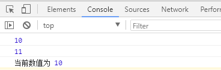

### redux 简要总结

#### 一、redux 的核心概念：

-   store
-   action
-   reducer

store : 记录所有的状态，state

action : action 本质是一个对象，告诉 dispath 需要做什么

reducer ： reducer 拿到 state 和 action，生成新的 state(根据老的状态和 action 来生成新的状态)

#### 二、redux 的简单使用：

1. 首先通过 reducer 新建 store，可以随时通过 store.getState 获取状态
2. 需要更新状态的时候，store.dispatch(action)来修改状态
3. reducer 函数接受 state 和 action，返回新的 state，可以通过 store.subscrible 来监听每次修改

```js
import { createStore } from "redux";
import { StringDecoder } from "string_decoder";

// 1. 新建reducer
function todo(state = 10, action) {
    switch (action.type) {
        case "add":
            return state + 1;
            break;
        case "minus":
            return state - 1;
            break;
        default:
            return 10;
            break;
    }
}

// 2. 使用createStore(reucer),传入一个reducer来新建一个store，并且可以使用store.getState()来获取到最新的state
let store = createStore(todo);
let init = store.getState();
console.log(init);

// 3.通过dispatch触发一个action来修改state，并且再次通过store.getState()来获取到最新的state
store.dispatch({
    type: "add"
});

let num = store.getState();
console.log(num);

// 4. 这里我们也可以使用store.subscribe()来添加一个变化监听器，每当dispatch一个action的时候，state就可能已发生变化，我们就可以在回调函数里监听state的变化。

function listener() {
    let current = store.getState();
    console.log("当前数值为", current);
}

store.subscribe(listener);

// 5. 此时再次触发一个action，通过stroe.subscribe()方法来监听state的变化
store.dispatch({
    type: "minus"
});
```

如图:
