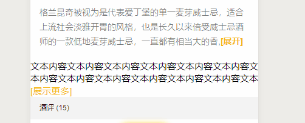

### 微信小程序开发总结(基于 uni-app)

#### 一、 实现页面向上滑动或者向下滑动时按钮隐藏，当滑动停止的时候，按钮出现


```html
<view
    :class="!isShowWriteBtn ? 'hide_page_bottom' : '' "
    class="page_bottom"
    @click="writeWineComment"
>
    <view class="write_wine_comment">写酒评</view>
</view>
<style>
    /* 写酒评 */
    .page_bottom {
        position: fixed;
        bottom: 70upx;
        left: 50%;
        margin-left: -90upx;
        width: 180upx;
        height: 80upx;
        line-height: 80upx;
        text-align: center;
        background: #ffc91f;
        border-radius: 36upx;
        box-shadow: 0 5upx 20upx #ffc91f;
        transition: all 0.6s ease-in-out;
    }
    .hide_page_bottom {
        bottom: -80upx;
    }
    .write_wine_comment {
        font-size: 30upx;
        font-weight: 500;
        color: rgba(51, 51, 51, 1);
    }
</style>
```

```js
export default {
    data() {
        return {
            scrollTop: 0, // 页面滑动后距离顶部的距离
            isShowWriteBtn: true // 是否显示底部写酒评按钮
        };
    },
    onPageScroll(ev) {
        this.handWriteBtn(ev);
    },
    methods: {
        // 处理滑动时底部发酒评按钮显示隐藏
        handWriteBtn(ev) {
            let that = this;

            //判断浏览器滚动条上下滚动
            if (
                ev.scrollTop > this.scrollTop ||
                ev.scrollTop == uni.getSystemInfoSync().windowHeight
            ) {
                //向下滚动
                that.isShowWriteBtn = false;
            } else {
                //向上滚动
                that.isShowWriteBtn = false;
            }
            //给scrollTop重新赋值
            setTimeout(() => {
                that.scrollTop = ev.scrollTop;
                setTimeout(() => {
                    // 如果当前的scrollTop和滚动的scrollTop值相同时，表示你滑动已经停止
                    if (ev.scrollTop == that.scrollTop) {
                        that.isShowWriteBtn = true;
                    }
                }, 300);
            });
        },
        // 写酒评
        writeWineComment() {
            // 处理函数逻辑
            //this.isShowCommentModal = true;
        }
    }
};
```

#### 二、 实现文字产出两行展示更多，点击展示更多，可以显示全部文字



```html
<view class="">
    <view class="outer" :class="isShowMaxHeight ? 'hidden_max_height' : ''">
        <view class="inner">
            文本内容文本内容文本内容文本内容文本内容文本内容文本内容文本内容文本内容文本内容文本内容文本内容文本内容
            文本内容文本内容文本内容文本内容文本内容文本内容文本内容文本内容文本内容文本内容文本内容文本内容文本内容1111
        </view>
    </view>
    <view v-if="isShowMoreData" class="show_more_data" @click="showMoreData"
        >[展示更多]</view
    >
</view>
<style>
    .outer {
        overflow: hidden;
        max-height: 80upx;
    }
    .hidden_max_height {
        max-height: 100%;
    }
    .inner {
        display: block;
        oveflow: auto;
        font-size: 30upx;
        line-height: 40upx;
    }
    .show_more_data {
        color: #f8b916;
        font-size: 30upx;
    }
</style>
```

```js
export default {
    data() {
        return {
            isShowMoreData: false,
            isShowMaxHeight: false
        };
    },
    onLoad() {
        let selectorQuery = uni.createSelectorQuery();

        selectorQuery.select(".outer").fields({ size: true });
        selectorQuery.select(".inner").fields({ size: true });

        selectorQuery.exec(res => {
            console.log("res", res);
            if (res[0].height < res[1].height) {
                this.isShowMoreData = true;
            }
        });
    },
    methods() {
        // 展示 更多
        showMoreData() {
            this.isShowMoreData = !this.isShowMoreData;
            this.isShowMaxHeight = !this.isShowMaxHeight;
        },
    }
};
```

#### 三、uni.uploadFile 上传多张图片方法封装

```js
import Config from "../config.js";
import { request } from "./request.js";

// 上传图片
/**
 *
 *
 * @param {Array} imgPath 		图片数组路径
 * @param {Number} type			1：问答图片 2：用户头像 3：酒图片
 */
function uploadImgs(imgPath = [], type = 1) {
    return new Promise((resolve, reject) => {
        let promisies = imgPath.map(path => {
            return new Promise((resolve, reject) => {
                uni.uploadFile({
                    url: Config.domain_name + "/server/common/v1/uploadPict",
                    filePath: path,
                    name: "file",
                    formData: {
                        type: type
                    },
                    success: uploadFileRes => {
                        let result = JSON.parse(uploadFileRes.data);
                        if (result && result.code == 200) {
                            resolve(result.data.picUrl);
                        } else {
                            reject(result);
                        }
                    },
                    fail: err => {
                        reject(err);
                    }
                });
            });
        });

        return Promise.all(promisies)
            .then(res => {
                resolve(res);
            })
            .catch(err => {
                reject(err);
            });
    });
}

module.exports = {
    uploadImgs
};
```


